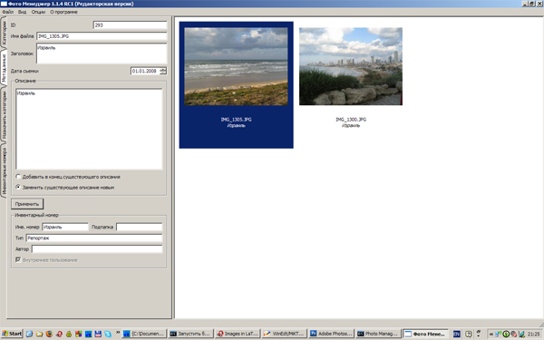
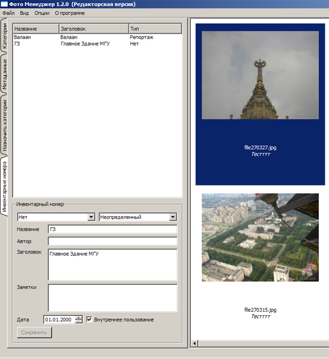
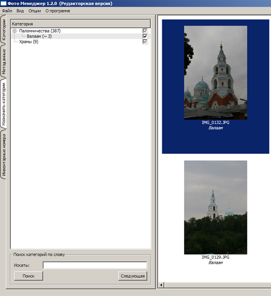

# (For archive purposes) PhotoManager

(Not sure it can even be built nowadays) just uploading here my first (2008/2009) freelance application: a crossplatform (C++/Qt4/PostgreSQL) app for photo mangament. Some publishing houses used it across Linux/Win/Mac workstations to catalog large amounts of photos they otherwise stored in bunch of CD-ROMs.

 
 

Manual (in Russian) can be found in [docs/manual/manual.pdf](./docs/manual/manual.pdf)
